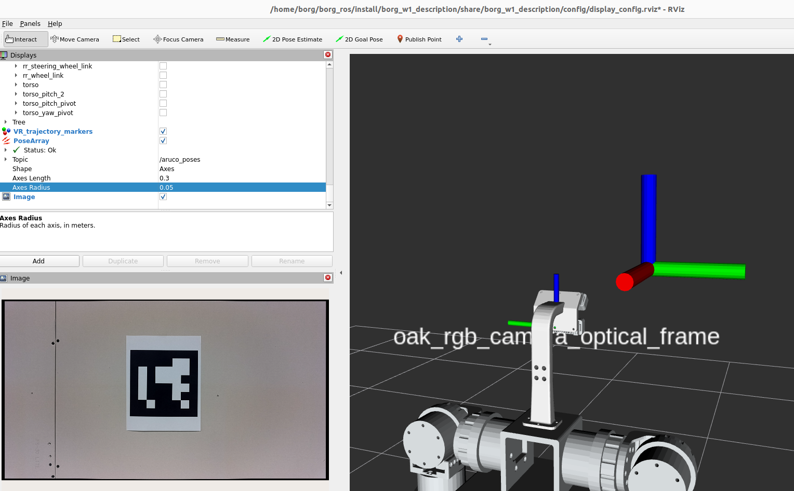

## Testing in real world
1. **Start the real camera.**  
    The front-facing camera mounted on the robot has the ID `14442C10E171DDD600`.

    ```
    ros2 launch depthai_ros_driver camera.launch.py
    ```
    Confirm that you see a message like  
    `[component_container-1] [INFO] [...] [oak]: Camera with MXID: 14442C10E171DDD600 and Name: 1.1.2 connected!`  
    in the terminal after launching the command.

    > **Note:** The USB hub port order matters. By default, `camera.launch.py` streams from the camera plugged into the first detected port. If both cameras are connected, ensure the front-facing camera (ID `14442C10E171DDD600`) is plugged into the correct port, or the launch file may select the other camera.

2. **Identify the RGB image and camera info topics.**  
    Run the following command in a separate terminal:

    ```
    ros2 topic list | grep oak
    ```
    Look for the RGB image topic (e.g., `/oak/rgb/image_raw`) and camera info topic (`/oak/rgb/camera_info`).  
    Update these topic names in `ros2_aruco/ros2_aruco/config/aruco_parameters.yaml`.  
    Also, comment out the `camera_frame` parameter in the same YAML file—the aruco node will use the default frame name from `/oak/rgb/camera_info`.

3. **Launch the robot model in RViz.**

    ```
    ros2 launch borg_w1_description display.launch.py
    ```

4. **Publish a static transform.**  
    This step is temporary and will be scripted later.

    ```
    ros2 run tf2_ros static_transform_publisher 0 0 0 0 0 0 camera_1 oak_rgb_camera_optical_frame
    ```

5. **Start the ArUco detection node.**

    ```
    ros2 launch ros2_aruco aruco_recognition.launch.py
    ```

6. **View detection results.**  
    You can check results via ROS topics or in RViz:

    ```
    ros2 topic echo /aruco_markers

    OR 

    ros2 topic echo /aruco_poses
    ```




## Testing in SIM

To test this repository with the prepared Gazebo world (`box_and_rack_world.world`) located in `robot_gazebo/worlds/`, launch the following commands in separate terminals:

1. **Launch the robot and MoveIt in Gazebo.**  
    This command starts the robot simulation in Gazebo along with MoveIt for motion planning.

    ```
    ros2 launch robot_gazebo borg_w1_moveit.launch.py
    ```

2. **Visualize the Gazebo world.**  
    The image below shows the simulated environment where the robot operates.

    

3. **Publish a static transform between camera frames.**  
    This command sets up a fixed transform between the camera's base frame and its optical frame, ensuring correct pose alignment.

    ```
    ros2 run tf2_ros static_transform_publisher 0 0 0 -1.5708 0 -1.5708 camera_1 camera_optical_frame
    ```

4. **Start the ArUco detection node.**  
    This launches the node that detects ArUco markers in the simulated camera feed.

    ```
    ros2 launch ros2_aruco aruco_recognition.launch.py
    ```

5. **View detection results.**  
    Use this command to display detected ArUco markers from the simulation.

    ```
    ros2 topic echo /aruco_markers
    
    OR 

    ros2 topic echo /aruco_poses
    ```
    ```


---

## Why is the static transform publisher needed?

The pose published by the ArUco marker package with respect to the camera has the X and Z axes swapped. This occurs due to differences in coordinate frame conventions between computer vision libraries and ROS.

### Coordinate Frame Conventions

**OpenCV (used by ArUco and many vision libraries):**
- X → right
- Y → down
- Z → forward (into the image)

**ROS (REP-103 standard):**
- X → forward
- Y → left
- Z → up

This difference means a static transform is required to correctly align the frames for accurate pose estimation.

