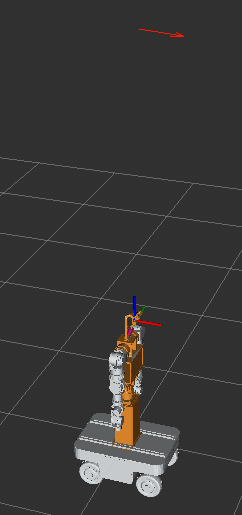

To test this repo with the gazbeo world (box_and_rack_world.world) prepared for the demo, 
present at ... robot_gazebo/worlds/ ... launch the following things in separate terminals 

```
ros2 launch robot_gazebo borg_w1_moveit.launch.py
```


```
ros2 run tf2_ros static_transform_publisher 0 0 0 -1.5708 0 -1.5708 camera_1 camera_optical_frame
```
```
ros2 launch ros2_aruco aruco_recognition.launch.py
```
To view the results
```
ros2 topic echo /aruco_markers
```

---


## The static transform publisher is needed because, 
in the pose that the aruco marker package publishes wrt camera,  the position value in x axis seems to be fillped with z...


### ChatGPT says... 

Yes — this is **expected** behavior and is due to differences in **coordinate frame conventions** between the camera (often using **OpenCV** conventions) and ROS (which uses **REP-103** coordinate conventions).

---

### üì∑ OpenCV (used internally by ArUco and many vision libraries)

In OpenCV / computer vision:

* **X** ‚Üí right
* **Y** ‚Üí down
* **Z** ‚Üí forward (into the image)

---

### 🤖 ROS (REP-103 standard for TF and poses)

In ROS:

* **X** ‚Üí forward
* **Y** ‚Üí left
* **Z** ‚Üí up

---

### üß≠ What this means for ArUco marker poses

If the ArUco detection library (like `aruco_ros` or `depthai-ros`) is giving the pose of the marker **relative to the camera**, and if it's using the **OpenCV convention**, then the pose axes will appear "flipped" when viewed in RViz or used in TF.

Specifically, you'll often see:

| ArUco Axis (OpenCV) | Appears as in ROS |
| ------------------- | ----------------- |
| X (right)           | Y (left/right)    |
| Y (down)            | Z (up/down)       |
| Z (forward)         | X (forward/back)  |

This results in the **X and Z axes appearing swapped or inverted** depending on the marker orientation and the way the pose is converted or broadcasted.

---

### ‚úÖ Fix / Align Axes

To fix this mismatch and publish a marker pose correctly in ROS TF:

1. You can **manually transform the pose** to match REP-103 using a static transform or code.
2. Or use `tf2_geometry_msgs` to convert the pose and republish it with corrected axes.
3. Some ArUco ROS packages let you set the output frame convention (check the docs for options like `output_frame` or `use_camera_frame`).

---

### üß™ Quick Debug Tip

Visualize the pose in RViz with an `Axes` marker and check:

* Does the **red arrow (X)** point forward (as expected in ROS)?
* If not, the pose frame needs to be remapped to match REP-103.

---


### My question???

The red arrow that I visualize in rviz, is at the wrong position (z position seems to be flipped with x position), and is pointing in the positive x axis of the camera...see that attached picture below...the frame shown in the picture is the camera frame, and the aruco marker in gazebo is right in front fo the x axis of the camera frame



### ChatGPT says...

Thanks for the image — this helps clarify the issue. Based on your description and what I see in the RViz visualization:

* ✅ The **red arrow** (X-axis of the ArUco marker pose) is **pointing correctly in the camera's X direction** — that's typical for OpenCV-based pose estimation.
* ‚ùå But the **position of the red arrow is not in front of the camera**; it's up above, indicating that the **Z and X position values may be flipped**.

---

### ✅ What’s Happening

It looks like you’re visualizing the ArUco marker's pose **relative to the camera frame**. Most ArUco libraries (including OpenCV and many ROS wrappers) output the marker’s pose in the **camera’s optical frame**, which uses the OpenCV convention:

| Axis | OpenCV Camera Frame | ROS (REP-103) Camera Frame |
| ---- | ------------------- | -------------------------- |
| X    | right               | forward                    |
| Y    | down                | left                       |
| Z    | forward             | up                         |

That means a pose reported as `(x=0.5, y=0, z=0)` in OpenCV means:

* 50 cm **in front** of the camera,
* but in ROS, that gets interpreted as **50 cm to the right**.

This is likely why your marker appears **above** and **misplaced** in RViz.

---

### 🛠️ Fix: Convert Pose from Optical Frame to REP-103

You need to **transform the pose** to match ROS coordinate frames. Here's how you can do it programmatically (Python):

```python
from geometry_msgs.msg import PoseStamped
from tf2_geometry_msgs import do_transform_pose
import tf2_ros
import tf_transformations
from geometry_msgs.msg import TransformStamped

def convert_pose_from_opencv_to_ros(pose_msg):
    # Create the fixed transform between OpenCV camera frame and ROS camera frame
    t = TransformStamped()
    t.transform.translation.x = 0
    t.transform.translation.y = 0
    t.transform.translation.z = 0
    # 90 deg rotation around X then -90 around Z: OpenCV ‚ûú ROS
    quat = tf_transformations.quaternion_from_euler(-1.5708, 0, -1.5708)
    t.transform.rotation.x = quat[0]
    t.transform.rotation.y = quat[1]
    t.transform.rotation.z = quat[2]
    t.transform.rotation.w = quat[3]
    return do_transform_pose(pose_msg, t)
```

You can wrap this around your ArUco pose output before publishing to ROS.

---

### üß™ Quick Diagnostic

If you're unsure whether your marker pose is being output in OpenCV-style or REP-103:

* Visualize both `camera_link` and `aruco_pose` in RViz
* If the marker pose appears **not directly in front of camera's X-axis**, but rather up/right, then it’s probably in OpenCV format.

---

### ‚úÖ Fix in RViz (Temporary)

If you just want to **visualize** it correctly and aren’t using the pose elsewhere yet, you can:

1. **Broadcast a static transform** between the optical frame (`camera_optical_frame`) and a REP-103 camera frame (`camera_link`).
2. Change your marker publisher to use the corrected frame.

---

